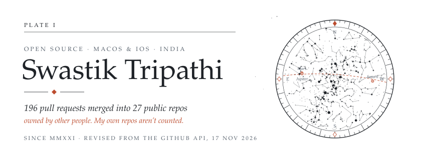
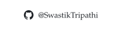
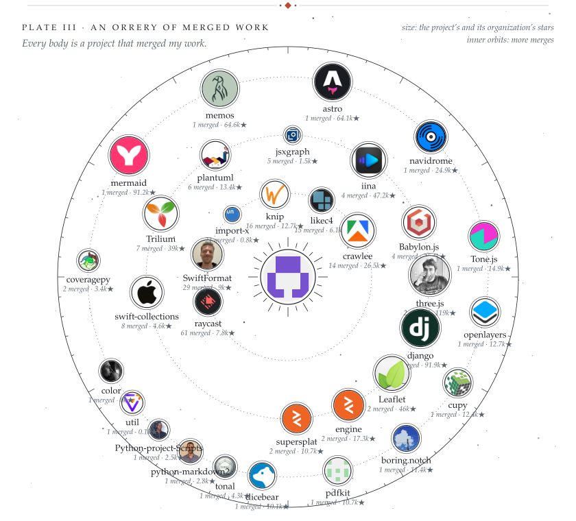
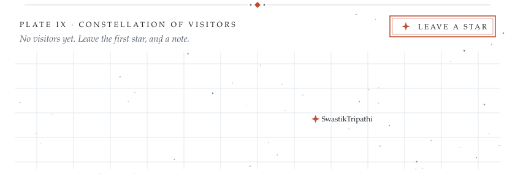

<!-- Generated by build/build.py (github edition). Edit that, not this file: it is rebuilt every 6 hours. -->

<a href="https://swastiktripathi.dev"><picture><source media="(prefers-color-scheme: dark)" srcset="assets/github-dark/hero.svg"></picture></a> 
<a href="https://swastiktripathi.dev"><picture><source media="(prefers-color-scheme: dark)" srcset="assets/github-dark/strip-web.svg"></picture></a><a href="https://www.linkedin.com/in/swastik-tripathi/"><picture><source media="(prefers-color-scheme: dark)" srcset="assets/github-dark/strip-linkedin.svg"></picture></a><a href="https://x.com/SwastikT_space"><picture><source media="(prefers-color-scheme: dark)" srcset="assets/github-dark/strip-x.svg"></picture></a><a href="https://github.com/SwastikTripathi"><picture><source media="(prefers-color-scheme: dark)" srcset="assets/github-dark/strip-github.svg"></picture></a> 
<a href="https://github.com/search?q=author%3ASwastikTripathi+is%3Apr+is%3Amerged+-user%3ASwastikTripathi&type=pullrequests"><picture><source media="(prefers-color-scheme: dark)" srcset="assets/github-dark/ledger.svg"></picture></a> 
<a href="https://github.com/search?q=author%3ASwastikTripathi+is%3Apr+is%3Amerged+-user%3ASwastikTripathi&type=pullrequests"><picture><source media="(prefers-color-scheme: dark)" srcset="assets/github-dark/orrery.svg"></picture></a> 
<a href="https://github.com/SwastikTripathi?tab=repositories"><picture><source media="(prefers-color-scheme: dark)" srcset="assets/github-dark/workshop-head.svg"></picture></a> 
<a href="https://cicadaevals.com"><picture><source media="(prefers-color-scheme: dark)" srcset="assets/github-dark/workshop-1.svg"></picture></a><a href="https://github.com/SwastikTripathi/wheres-my-money"><picture><source media="(prefers-color-scheme: dark)" srcset="assets/github-dark/workshop-2.svg"></picture></a><a href="https://github.com/SwastikTripathi/ghost-in-the-wrist"><picture><source media="(prefers-color-scheme: dark)" srcset="assets/github-dark/workshop-3.svg"></picture></a><a href="https://github.com/SwastikTripathi/lightstick"><picture><source media="(prefers-color-scheme: dark)" srcset="assets/github-dark/workshop-4.svg"></picture></a> 
<a href="https://github.com/search?q=author%3ASwastikTripathi+is%3Apr+is%3Amerged+-user%3ASwastikTripathi&type=pullrequests"><picture><source media="(prefers-color-scheme: dark)" srcset="assets/github-dark/merged.svg"></picture></a> 
<a href="https://github.com/search?q=author%3ASwastikTripathi+is%3Apr+is%3Aopen+-user%3ASwastikTripathi&type=pullrequests"><picture><source media="(prefers-color-scheme: dark)" srcset="assets/github-dark/open.svg"></picture></a> 
<picture><source media="(prefers-color-scheme: dark)" srcset="assets/github-dark/milestones.svg"></picture> 
<a href="https://github.com/search?q=author%3ASwastikTripathi+is%3Apr+is%3Amerged+-user%3ASwastikTripathi&type=pullrequests"><picture><source media="(prefers-color-scheme: dark)" srcset="assets/github-dark/almanac.svg"></picture></a> 
<a href="https://github.com/SwastikTripathi/SwastikTripathi/issues/new?title=%E2%9C%A8+Leave+a+star&body=Write%20a%20short%20note%20for%20the%20sky%20on%20the%20line%20below%20%28optional%2C%20up%20to%2080%20characters%29%2C%20then%20press%20Create.%0A%0A"><picture><source media="(prefers-color-scheme: dark)" srcset="assets/github-dark/visitors.svg"></picture></a>

<b>Open the boards</b>: every pull request above, with links

 

**Recently merged**

| | Project | Pull request | Merged |
|:-:|---|---|---|
|  | tonaljs/tonal | [docs(chord): update the chordScales example for the new scale families](https://github.com/tonaljs/tonal/pull/580) | Nov 23 |
|  | likec4/likec4 | [fix(generators): write Markdown export titles as literal one-line headings](https://github.com/likec4/likec4/pull/3609) | Nov 23 |
|  | likec4/likec4 | [fix(generators): escape quotes in metadata filter values of generated LikeC4](https://github.com/likec4/likec4/pull/3603) | Nov 23 |
|  | likec4/likec4 | [fix(generators): escape the view title in PlantUML export](https://github.com/likec4/likec4/pull/3599) | Nov 23 |
|  | likec4/likec4 | [fix(generators): keep &lt;, > and & in Draw.io labels through export and import](https://github.com/likec4/likec4/pull/3598) | Nov 23 |
|  | likec4/likec4 | [fix(generators): export layouted edge routes to Draw.io](https://github.com/likec4/likec4/pull/3608) | Nov 23 |
|  | antvis/G6 | [fix(utils): keep angle() from returning NaN for parallel vectors](https://github.com/antvis/G6/pull/7700) | Nov 23 |

**Open pull requests**

| | Project | Pull request | Opened | Review |
|:-:|---|---|---|---|
|  | excalidraw/excalidraw | [fix(editor): don't snap dragged frames to their children's old positions](https://github.com/excalidraw/excalidraw/pull/12166) | Sep 25 | Reviewing |
|  | mermaid-js/mermaid | [fix(xychart): label each bar series with its own values when showDataLabel is true](https://github.com/mermaid-js/mermaid/pull/8521) | Oct 23 | Approved |
|  | mermaid-js/mermaid | [fix(commonDb): decode HTML entities in title and accessibility text](https://github.com/mermaid-js/mermaid/pull/8560) | Oct 26 | Approved |
|  | usememos/memos | [fix(web): show 1.0 MB instead of 1024.0 KB at file size unit boundaries](https://github.com/usememos/memos/pull/6560) | Nov 14 | Reviewing |
|  | slidevjs/slidev | [docs: add Cloudflare Workers to the hosting guide](https://github.com/slidevjs/slidev/pull/2830) | Nov 9 | Open |
|  | pixijs/pixijs | [fix: keep roundShape corners from turning NaN at right angles](https://github.com/pixijs/pixijs/pull/12442) | Nov 21 | Reviewing |
|  | pixijs/pixijs | [fix: continue a path from the start of the subpath after closePath](https://github.com/pixijs/pixijs/pull/12443) | Nov 21 | Reviewing |

Leave a star: click the constellation above, write a short note if you like, and press <b>Create</b>. A GitHub Action puts your star in the sky within a minute; notes appear once I've read them.

Rebuilt every six hours from the GitHub API by <a href="build/build.py">build/build.py</a> · last rebuilt Nov 24, 2026 · also in the <a href="alt/README-classy.md">classy</a> and <a href="alt/README-retro.md">retro</a> and <a href="alt/README-paper.md">paper</a> editions

